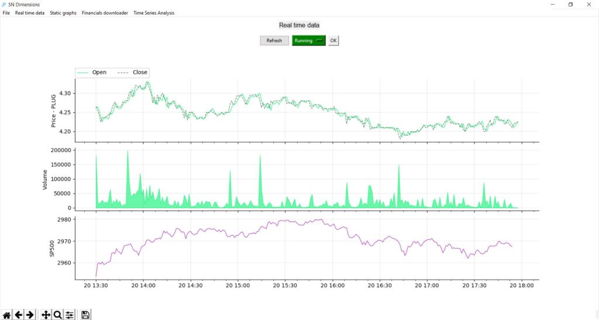
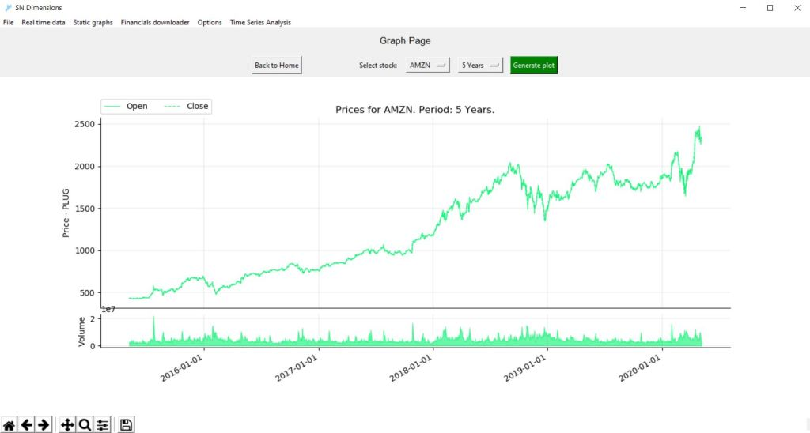
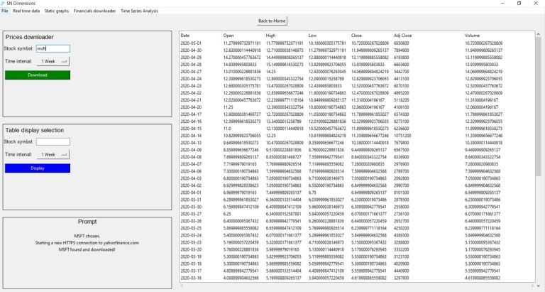

# SNDimensions
“SN Dimensions” stands for Signal & Noise Dimensions. This is the first software I built. It is entirely made with Python and Tkinter. The aim was to learn to build a full Graphical User Interface (GUI) from scratch and to create an interface where the user could just enter a ticker, click and download the corresponding financial data instead of having to code every time to connect to an API. The user can choose the time frame he wants for the downloads (day, months, years).

The “Real time data” page refreshes approximately every ten seconds, getting data from yahoofinance.com. There is a price graph, a volume graph and a “benchmark” graph (SP500 in the case below). The user can stop the automatic refresh and can zoom in the graphs in order to have a more precise view of the data. There is also the possibility to download a picture of the current graphs.

All the data downloaded by the user is stored in a sqlite3 database that is connected to the program. There is also a log window where the user can see whether the API recognized the symbol and whether the data was successfully downloaded and stored or not.

There is another page where the user can display the downloaded data in a table.

